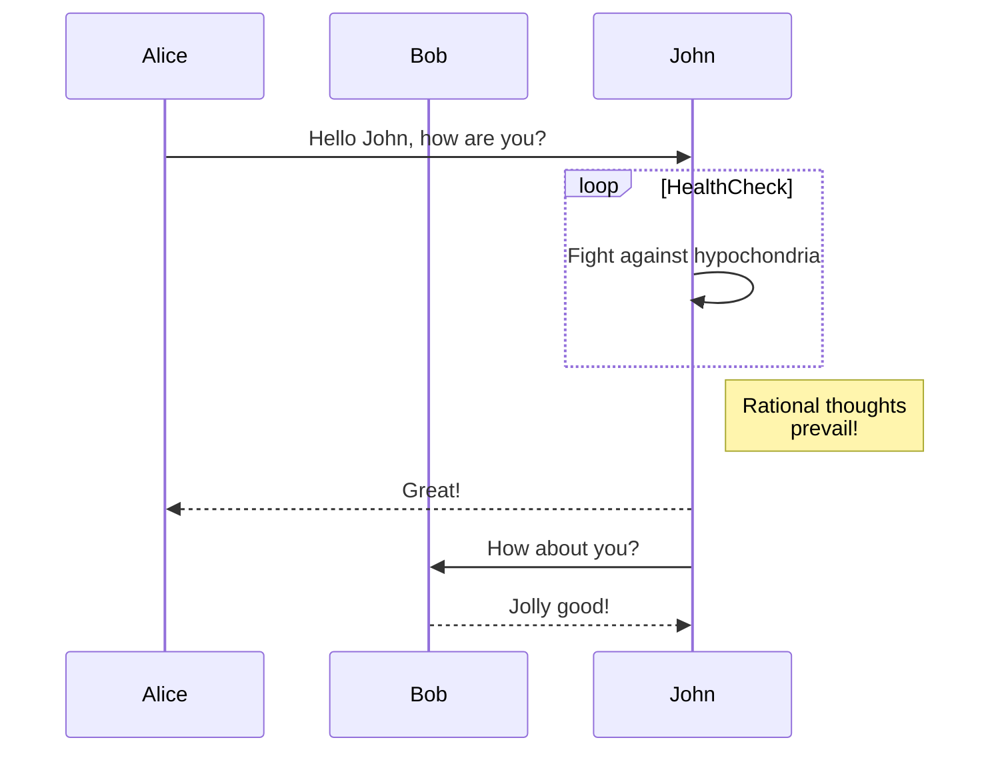

I often use my own blog as a way to try out ideas and frameworks.  Recently [someone in the mithril chat](https://mithril.zulipchat.com/#narrow/stream/324076-general/topic/astro-mithril.20package.20now.20supports.20Astro.20v4.2Ex) mentioned they liked Astro for SSG.  They had made a mithril package for astro's "Framework Island" feature.

My blog has always been hand rolled.  It's not very hard to load some markdown files from disk and convert them into HTML so I never really saw the attraction.  But I also find myself feeling pretty burnt out creating "contentful" pages for work.  I thought I'd give it a go.  It's the little things that add up.  E.g. even for my simple blog I had to handle syntax highlighting, rss feeds, mermaid charts.  And there was more I wanted to do but just never found the motivation.

Its easy to fall into analysis paralysis, or to get excited and try some new technical idea on each little side project.  That all eats up time that should probably be spent elsewhere.  So maybe using something specifically designed for that task could be beneficial.

At the time of writing, this site is now powered by Astro.  I'll use this post to document the experience and the set up I landed on.

In short, I like it, I would even recommend it for many use cases.  For me personally I'm not sure if I'll keep using it.  But I think the real measure of success will be if I start writing more instead of tinkering with tech stacks.  Time will tell.

### The DX is good

First of all, the developer experience is excellent.  I used `npm create astro` and followed the wizard and was up and running quickly.  The documentation is comprehensive and easy to follow.  The VSCode extension works well.  Writing Astro components doesn't feel foreign, and a lot of the decisions re: the Astro component programming model are interesting and show a lot of thought has gone into what Astro's roles and responsibilities are and where to draw that line.

At other times though it feels like Astro is trying to have an answer for every question.  I think it could benefit from a smaller scope with some recipes / patterns to solve those other areas.

I get into it more as we go on.

### The Astro component model

An Astro component is pretty much a HTML file.  You write normal HTML but with the ability to inject variables via `{ ... }` escapes (similar to JSX).

At the top of the file you can use optionally use typescript.  These scripts run server side and allow you to import components, define variables, fetch data etc.  It looks like this:

```astro
---
const a = 1
---

<p>The value of a: {a}</p>
```

You can also use `script` tags in your astro components.  If the component is mounted `n` times your script will be deduped and only run one time.  The script will also only run after all content has rendered and loaded, so there's no need to listen to `ready` events

My `posts/[post].astro` component uses script tags to render [mermaid.js](https://mermaid.js.org/) charts.

Here's an example from their website:



And the source:

```
sequenceDiagram
    participant Alice
    participant Bob
    Alice->>John: Hello John, how are you?
    loop HealthCheck
        John->>John: Fight against hypochondria
    end
    Note right of John: Rational thoughts <br/>prevail!
    John-->>Alice: Great!
    John->>Bob: How about you?
    Bob-->>John: Jolly good!
```

I use a custom remark plugin to convert markdown with `mermaid` codefences into a `pre` tag with the class `mermaid`.  Then all I need to do is just load the mermaid script after everything has rendered.

```astro
<Nav />
<div class="post">
    <h1>{entry.data.title}</h1>
    <Content />
</div>
<PostList />
<script is:inline type="module">
    await import('https://esm.sh/mermaid@11.3.0')
</script>
```

I load `mermaid` from a CDN because astro was being too clever and automatically bundling it which I didn't want it to do as I wanted to keep the Astro builds as close to HTML/CSS as possible.

You'll notice the `is:inline type="module"` this basically tells Astro, don't optimize this, don't mess with it, don't dedupe it, just render it inline as part of the markup.  At that point I have to use `type="module"` (normally not necessary for an Astro script tag) to be able to use `import` or top level await.

The only reason I am using `is:inline type=module` instead of a normal script tag is because Astro would complain it couldn't find the dependency `https://esm.sh/mermaid@11.3.0` in my `node_modules`.  This is one of those things where I was grateful for an escape hatch, sometimes frameworks are too smart for their own good.

The remark plugin was adapted from [JuanM04's blog](https://github.com/JuanM04/portfolio).  I took less precautions than in his example as I trust that I'm not going to write dangerous HTML in my markdown, in fact, I might <button id="btn">Want to do that</button>.

<script>
let colours = ['hotpink', 'tomato', 'lime', 'blue', 'green']
btn.addEventListener('click', e => {
    let colour = colours.shift()
    colours.push(colour)
    e.target.style.backgroundColor = colour
    e.target.style.color = 'white'
})
</script>
<style>
    #btn {
        border: solid 1px #EEE;
        padding: 1em;
        margin-top: 1em;
        border-radius: 0.5em;
    }
</style>

Here's the plugin inlined into the astro config:

```js
import { defineConfig } from 'astro/config';
import { visit } from "unist-util-visit"

export default defineConfig({
    site: 'https://james-forbes.com',
    markdown: {
        remarkPlugins: [
            () => tree => {
                visit(tree, "code", node => {
                    if (node.lang !== 'mermaid') {return;}

                    let newNode = node
                    newNode.type = "html"
                    newNode.value = `
                    <pre class="mermaid">
                        ${newNode.value}
                    </pre>
                    `
                })
            }
        ]
    }
});
```

Very simple stuff.  At first glance I was thinking what is unist, do I need to install some 3rd party plugin just to do this simple task?

So that led me to researching what remark, rehype, retext etc all are - I had no idea there was this big ecosystem of parsers sitting on top of a unified AST.  You can even transform normal written languages (e.g. the English language) via an AST.  And that Unified AST, that's what unist is.  It's already a dependency of astro, so there was no extra dep to install.

Probably the coolest part of the Astro component model is you can [import markdown files](https://docs.astro.build/en/guides/markdown-content/).

The imported files gives you all the frontmatter / metadata on the post, and the content itself as a `Content` component.

You can also just drop markdown in your `pages` directory and navigate to it.  You can use layouts in the frontmatter to control how the page is rendered - all very neat.

There was one thing that confused me though...

### Styling in Astro

In an Astro component you can write `<style>` tags.  These styles are automatically scoped to the local component.  So you can write global styles and they won't impact other files.

This is great!  But it surprised me that markdown files aren't automatically styled according to the scope of the component that mounted it.  Intuitively that feels wrong.  So I ended up having to use global styles to work around this.

I think you can work around this with [set:html](https://docs.astro.build/en/reference/directives-reference/#sethtml), and I did find a stub in the docs about [Styling markdown](https://docs.astro.build/en/guides/styling/#markdown-styling):

> Any Astro styling methods are available to a Markdown layout component, but different methods will have different styling effects on your page.
> You can apply global styles to your Markdown content by adding imported stylesheets to the layout that wraps your page content. It is also possible to style your Markdown with `<style is:global>` tags in the layout component. Note that any styles added are subject to Astro’s cascading order, and you should check your rendered page carefully to ensure your styles are being applied as intended.
> You can also add CSS integrations including Tailwind. If you are using Tailwind, the typography plugin can be useful for styling Markdown.

I found this super confusing.

I thought, maybe I needed to use Layout components, but that doesn't inject styles either, that just lets you control the surrounding markup and styles of the rendered markdown.

Eventually I found this:

> 🚀 Tip!  A common pattern in Astro is to import global CSS inside a Layout component. Be sure to import the Layout component before other imports so that it has the lowest precedence.

So it all boils down to, you need to use global styles.  When you import a style, its global and not scoped.  When you use a layout component you're encouraged to use imported global CSS there.  And you can also use `<style is:global>`.

I like to default to just doing things inline until I run into problems so that's what I did, after probably an hour of reading I feel like that might even be the correct solution just without the boilerplate of moving a stylesheet into a separate file or into a Layout component.

But I can't help but think, Markdown shouldn't be treated as a separate component boundary, that was just the wrong decision on Astro's part, its a lot of abstraction and confusion just to style a markdown document which is probably a core part of using Astro, not great.

### I'll manage the data thanks...

Astro is great, but I did find it was introducing a lot of unnecessary abstractions for dealing with data.  I'm late to the party but I'm not surprised Astro Studio is winding down. 

I completely avoided AstroDB, I don't see any value in it.  If you need a DB but you don't want to learn how to use them, I can respect that, but then use a CMS.  If you are going to dabble with a DB, then learn a standard system, spin up postgres on fly, supabase or neon.  Use SQLite or DuckDB, but don't use some awful JS / TS wrapper on top of SQL.  It will hurt performance, and it will hinder your learning.

I did try their content collections, at first I thought there'd be some eventual payoff, but its pretty uninspiring.  If I was writing this from scratch I'd probably skip it.  Maybe this is intended for big teams pumping out massive amounts of content and having it validated as you author, but then wouldn't that usecase involve a CMS and you'd validate metadata via an API endpoint?  I don't get it personally.

You get this API to query your markdown files:


```typescript
const posts = await getCollection('posts', x => !x.data.archived)
```

but Astro already has the ability to glob for markdown.

```typescript
const posts = await Astro.glob('../pages/post/*.md').then( xs => xs.filter( x => !x.frontmatter.archived ))
```

Ok sure, that is a tiny bit more verbose, and the frontmatter is untyped, but this is 90% of what content collections are without any new abstractions.

If we wanted to write a `zod` schema and validate it in the Astro component itself, we'd get 99% of what content collections are without a lot of new concepts.  This just feels like it should be a recipe not a built in feature of the framework.

```typescript
const posts = await Astro.glob('../pages/post/*.md')
    .then( schema.parse )
    .then( xs => xs.filter( x => !x.frontmatter.archived ))
```

I genuinely don't understand why content collections exist.  I'll probably factor them out later from this blog.

### RSS

I was excited to see Astro handles RSS for you, as it just meant one more bit of my code I can delete.  Unfortunately it only seems to support one feed type.  So I just copied my old RSS code and put it in an Astro endpoint.

I also thought it was kind of weird you have to install a 3rd party markdown library for the RSS integration when they've got a really powerful Markdown engine built in, just feels really wrong.

Here's the RSS feed logic:

```typescript
// /src/pages/feeds/[feedType].js

import { Feed } from 'feed'
import { getCollection } from 'astro:content';
import MarkdownIt from 'markdown-it'; // why do we need this...?
const parser = new MarkdownIt();

const posts = (await getCollection('posts', x => !x.archived)).sort( x => -x.data.created.getTime())

const href = 'https://james-forbes.com'
const author = {
    name: 'James Forbes'
    ,link: 'https://github.com/JAForbes'
}
const feed = new Feed({
    title: 'James Forbes'
    ,description: 'Interested in any type of design and the individual componentry of calcified ideas.'
    ,id: href
    ,link: href
    ,language: 'en'
    ,image: 'https://james-forbes.com/assets/img/bio.jpeg'
    ,updated: new Date()
    ,feedLinks: {
        json: 'https://james-forbes.com/feed/json'
        ,atom: 'https://james-forbes.com/feed/atom'
    }
    ,author
    ,copyright: 'All rights reserved ' + new Date().getFullYear() + ', James Forbes'
})


for( let post of posts ) {
  
    feed.addItem({
        title: post.data.title
        , id: href + '/posts/' + post.slug
        , link: href + '/posts/' + post.slug
        , author: [
            author
        ]
        , content: parser.render(post.body)
        , date: new Date(post.data.created)
    })
}

export function GET(context) {

    const [body, contentType] = context.params.feedType === 'rss'
        ? [feed.rss2(), 'text/xml']
        : context.params.feedType === 'atom'
        ? [feed.atom1(), 'text/xml']
        : context.params.feedType === 'json'
        ? [feed.json1(), 'application/json']
        : [feed.rss2(), 'text/html']

  let res = new Response(body)
  res.headers.set('content-type', contentType)
  return res
}

export function getStaticPaths(){
    return [
        { params: { feedType:'atom' }},
        { params: { feedType:'json' }},
        { params: { feedType:'rss' }},
    ]
}
```

So this adds a `/feeds/:feedType` route to the app, the `getStaticPaths` lets the static build pre-render the 3 feed types.

I like how most of this isn't Astro specific.  And the request/endpoint abstraction is very light.  This is where I feel, yet again, we don't need dedicated npm packages, or integrations, or abstractions.  There should just be an RSS recipe that is documented, because just having static endpoints is all the framework really needs to provide.

### Memory usage

A few times Astro crashed my dev server because it was so memory hungry.  Also I could never successfully run `npm run build` with the default call to `astro check` as it would run out of memory every time.  I don't even know what `astro check` does but it was analysing minified files telling me there were unused variables named `t` and `x` in minified js.

I don't know why Astro would use much memory, I know it is sitting on top of Vite (which I've found is pretty efficient in my other projects).  I haven't researched this at all, but just from reading open github issues on memory usage I assume each page is not a distinct entry (in Rollup/Vite parlance).  If they were, then memory usage shouldn't grow as the number of pages increases because pages can be rendered in parallel and the memory usage for each of those renders is bounded.

When I see things like this I get nervous, because I don't want to invest in an ecosystem that I can't rely on to be performant.  I've read Astro performs well with SSR, but then I'm seeing github issues saying Astro is [10x slower than Solid Start](https://github.com/withastro/astro/issues/11454).

Theoretically Astro should be able to be super fast.  Compared to a normal app an astro site should have far less files and moving pieces.  This tiny blog shouldn't get GC crashes, but it does.  I'm hoping someone in the Zig or Rust community can build an Astro-like with the cool bits (and skip the largely pointless bits).

But!  For static builds, if you skip `astro check`, it is pretty quick for this site.  Actually a quick overview of the build / deploy for this site (and another rant).

### Docker is good

A lot of people seem to think Docker is slow or bad, and that everything should be bare metal.  But Docker is no less "bare metal" than your process running directly on the main OS with some additional native isolation.

A docker image is just some files tarballed and gzipped, extracted in a chrooted directory with some dedicated linux namespaces.  The overhead of running just the Docker part is the process isolation part which is a native part of Linux.  Docker itself is not doing much more than acting as middleman between you are containerd, its parsing your CLI args or REST commands and then handing it over to containerd to do the actually work of monitoring your container.

- [Docker implemented in bash](https://github.com/p8952/bocker)
- [Building docker from scratch](https://ericchiang.github.io/post/containers-from-scratch/)

If you use docker, you get a standard way of sharing and maintaining software.  You get all kinds of useful features for networking and mounting volumes.

And then Docker images are just a (very simple) file format, you can unpack them and run them as native VMs.  This is what Fly.io does.  So even if you don't believe me and think that Docker is slow (it isn't), you can still use Docker images and docker registry's and unpack the docker image onto your bare metal server as long as the base image and the VM OS are compatible.

Everyone seems to like WASM now, but they don't like Docker.  But WASM essentially solves the same problems as Docker.  It's a way for us to execute native code in arbitrary environments with process isolation.  Having a universal build target is a really cool thing but people seem to only agree when that universal build target is WASM.

The reason I'm ranting about Docker is, if we just used Docker as the standard for shipping things, we wouldn't need massive amounts of documentation like [SvelteKit](https://kit.svelte.dev/docs/adapter-node) has.

Or we wouldn't need to funnel users to single vendors just to save us the maintenance burden of explaining how to ship our thing on every vendor under the sun.  E.g. Astro's tutorial gets you to ship to Netlify on [Step 1](https://docs.astro.build/en/tutorial/1-setup/5/).  I can see some value in this because it helps people get their stuff online when they may not know how to do that.  But I feel that should be a bonus step at the end of a tutorial, you should first get people comfortable with your framework.  Then when you're encouraging people to ship a site, help them ship to any vendor or server by using standard tools.  Don't contribute to platform lock in.

With Docker we can also cross polinate ecosystems more easily.  Use a little Rust here, use a little Go over there.  Without something like `docker-compose` that quickly becomes *annoying*.

Sigh.

Ok so I used Docker for deployment.  The Dockerfile uses multi stage builds.  So the final image doesn't include Node.js at all.

Here we go:

```dockerfile
FROM node:20-alpine AS build                    # this is the build image
WORKDIR /usr/src/app/                           # we spin it up just to build the astro site
COPY package-lock.json package.json ./          # once its done we copy the dist folder into a different image
RUN npm ci                                      # and this image is discarded and never sent to the cloud vendor

COPY src ./src                                  # So you can build and deploy this without even having
COPY public ./public                            # to have node.js installed on your machine.
COPY astro.config.mjs ./                        # 
RUN npm run build                               # Here is the build... and we are done

FROM caddy:2.6.4-alpine AS serve                # now we start a new image, its just using caddy
                                                # a reverse proxy written in Go, its great.  Don't use nginx.
COPY Caddyfile /etc/caddy/Caddyfile             # Drop in our Caddyfile config
COPY --from=build /usr/src/app/dist /srv        # Copy the dist, that is everything
```

This spits out a final image that is 24MB.  That's 24MB for a completely isolated, reliable, reproducible operating system.

Here's the Caddyfile config:

```cobol
{
	auto_https off
	servers {
		trusted_proxies static private_ranges
	}
	log {
		level INFO
		format console
	}
}

http://james-forbes.com:8080 {
	handle /* {
		root * /srv
		encode gzip
		try_files {path} {path}/index.html
		file_server
	}
}
```


For local development I just use `npm run dev` and rely on the Node in my ambient env.  I'd continue to do that until I needed a database (or some process from another ecosystem) and then I would immediately use `docker compose`.

But I can test the prod build easily like so:

```bash
# Build the image, give it a --tag so we can
# run it via the tag in the next step.
# (we won't use that tag for deploying)
docker build . --tag blog:latest --no-cache

# Spin up the container.
# Map 8080 in the container to 8080 on the host
# Delete the container the moment it exits
docker run --rm -p 8080:8080 blog:latest
```

I use fly.io to host the container ([which actually runs as a Firecracker MicroVM, not a container on Fly](https://fly.io/blog/fly-machines/))

To deploy, I've got this `toml` which was auto generated by running `fly launch`.

```toml
app = "james-forbes"
kill_signal = "SIGINT"
kill_timeout = 5
processes = []


[http_service]
  internal_port = 8080
  auto_stop_machines = true
  auto_start_machines = true
  min_machines_running = 0
  processes = ["app"]
```

No reference to Docker here, because it is the default build.  The way it should be.

But we could ship so easily now to any vendor because we're using standards.

### Overall

I think Astro is interesting.  My favourite thing is being able to import a markdown file, but then ironically I stopped doing that because the docs told me to use content collections (which are pointless).

I think Astro suffers from something a lot of frameworks suffer from, trying to solve every possible user problem with a (capital A) Abstraction.

A long time ago I wrote [Philosophies.  Not Frameworks.](https://james-forbes.com/posts/philosophies-vs-frameworks).  I wish more popular JS tools would adhere to that.  A lot of things in Astro could just be recipes.  Sometimes they are and they are presented as being part of the framework (when its just a convention) e.g. `/styles` and `/layouts` are just conventions but initially the docs present them as being the official way to do things.

Having a framework answer for the data layer that deviates from standards.   Encouraging people to ship to Netlify.  It feels like its trying to be an all encompassing product instead of a focused solution.  It probably helps adoption but it makes me hesitant to fully embrace it in the same way I would embrace a tool that focuses on one domain.  It also feels like the target audience is people who don't want to learn the underlying platform.  I can respect that because it lowers the barrier of entry, but if you start to introduce non standard concepts and abstractions it starts to become irresponsible.  Yeah create the lower barrier of entry but always be an on ramp towards standards.

Using Astro I feel more motivated to improve the site in ways that are unrelated to exploring or optimizing tech stacks.  I might make a tags page, add a comment system, embed code playgrounds, create an archive... etc.

Despite all my criticisms Astro does hit a sweet spot.  I just think in a future release they cut down on the abstractions a little bit and streamline the docs.  Pretty light criticism really.